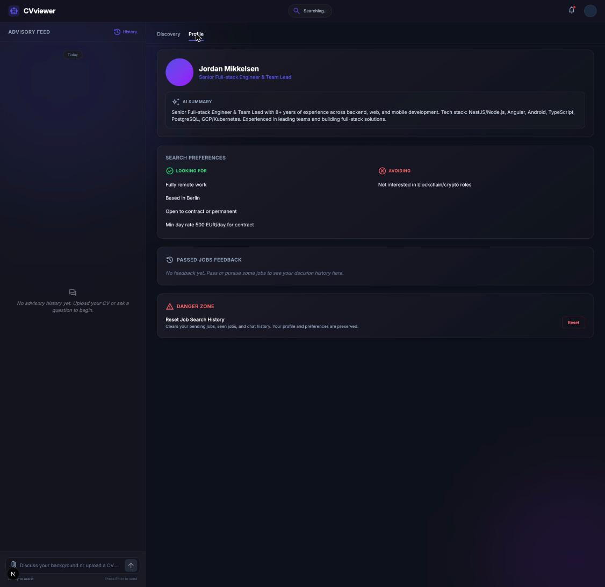
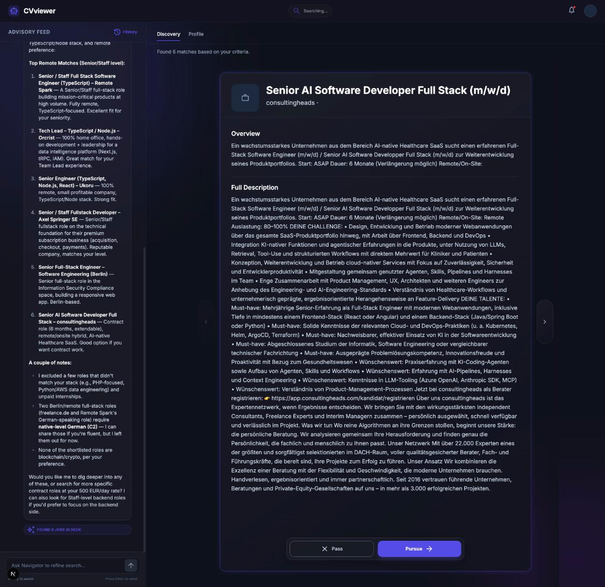
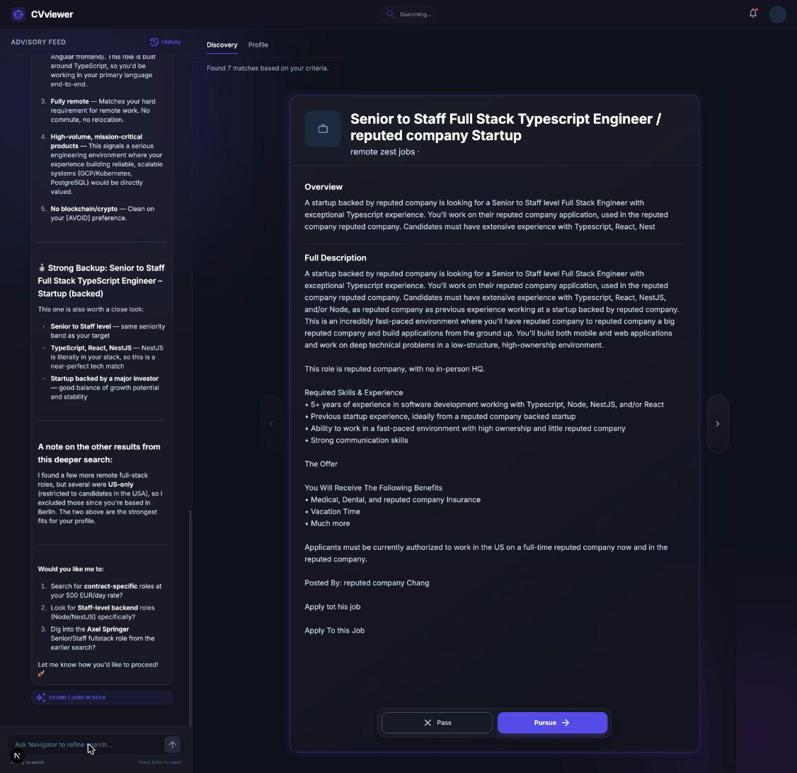

# JobFinder Agent

An AI job-search companion that onboards you through a conversation, builds a
structured profile from your CV, then continuously finds, ranks, and discusses
job matches with you — swipe-to-decide, chat to refine. Backend is a
multi-graph LangGraph agent behind a typed FastAPI service; frontend is
Next.js with a Zustand store driving the swipe/chat UI.





## Architecture

The agent is split into three cooperating LangGraph graphs rather than one
monolithic chatbot, because onboarding, open-ended chat, and job search are
different problems with different failure modes:

- **Onboarding is a data-collection problem.** A dedicated profile graph
  drives the conversation until it has a usable profile, using tool-calling
  (not free-text parsing) to write structured fields into cross-session
  memory — so "I'm a Senior Python Dev" becomes a typed update, not a string
  the rest of the system has to re-interpret later.
- **Chat is an open-ended, tool-using problem.** The discovery graph is a
  standard reasoning-and-tool-call loop, but it treats job search itself as a
  *delegated subtask* rather than one more tool call: when the user's intent
  needs a search, the chatbot hands off to a dedicated job-specialist
  subgraph and resumes once it returns, instead of trying to reason about
  fetching, filtering, and ranking jobs inline.
- **Ranking jobs at volume is a batch problem, not a chat turn.** The
  job-specialist subgraph fetches listings from JSearch, chunks them, and
  summarizes/scores each batch **concurrently** (`asyncio.gather` over
  LLM calls with structured output, not one job at a time) before handing a
  ranked shortlist back to the conversation — the difference between a
  chatbot that stalls on 20 job descriptions and one that doesn't.

All three graphs checkpoint to Postgres (`langgraph-checkpoint-postgres`), so
a user's onboarding state, chat history, and profile persist across sessions
without the backend holding anything in memory. Prompts are written
defensively where the model has a known failure mode — e.g. the search-query
schema explicitly forbids boolean operators and salary numbers in the query
string, because JSearch's API silently returns zero results otherwise, a
constraint discovered empirically and encoded directly in the tool's
Pydantic field description so the LLM sees it every time it calls the tool.

`ChatService` picks which graph handles a request (`discovery` vs `profile`
workspace) and streams the result back through `POST /api/chat`; the LLM
provider itself is swappable per environment (DeepSeek / Gemini today) behind
a single `ACTIVE_LLM_MODEL` setting, so the agent logic doesn't depend on one
vendor's API.

## Quick Start

### Option 1: Single Command (Recommended)

Run a single script from the project root to automatically manage virtual environments, install dependencies, and start both the FastAPI backend and Next.js frontend concurrently:

```bash
./scripts/dev.sh
```

- **Backend API**: `http://localhost:8000` (Docs: `http://localhost:8000/docs`)
- **Frontend App**: `http://localhost:3000`
- **Stop All Services**: Press `Ctrl+C` in your terminal.

---

### Option 2: Manual Start

#### Backend (FastAPI)

1. **Setup & Install**:
    ```bash
    python3 -m venv .venv
    source .venv/bin/activate
    pip install -e ".[dev]"
    pre-commit install
    ```

2. **Configure Environment**:
    - Copy `.env.example` to `.env`
    - Add your `JSEARCH_API_KEY` (via RapidAPI) and chosen LLM API key.
    - The backend needs Postgres (for LangGraph checkpointing) — `docker-compose up -d db` is the quickest way to get one running locally.

### LLM Provider Configuration

The active model is controlled by `ACTIVE_LLM_MODEL` in `.env`:

| `ACTIVE_LLM_MODEL` | Required Key in `.env` | Provider |
| :--- | :--- | :--- |
| `deepseek-chat` *(default)* | `DEEPSEEK_API_KEY` | DeepSeek |
| `gemini-flash-latest` | `GEMINI_API_KEY` | Google Gemini |

To switch providers, update `.env`:
```env
ACTIVE_LLM_MODEL=deepseek-chat
SUMMARISATION_LLM_MODEL=deepseek-chat
```

3. **Run**:
    ```bash
    source .venv/bin/activate
    uvicorn app.main:app --reload
    ```

#### Frontend (Next.js)

1. **Install & Run**:
    ```bash
    cd frontend
    npm install
    npm run dev
    ```

> **Note**: The Next.js dev server proxies all `/api/*` requests to the FastAPI backend on port 8000.

---

### Cleaning & Resetting

To wipe build caches, test caches, Docker database volumes, and temporary logs (while preserving `.venv` and Git hooks):

```bash
./scripts/clean.sh
```

## Development

### Backend Checks
Run all backend checks (formatting, linting, typing, and tests) using the unified test runner:
```bash
./scripts/test.sh
```

Individual checks:
- **Lint**: `ruff check .`
- **Format**: `ruff format .`
- **Type Check**: `mypy .`
- **Test**: `pytest`
- **Coverage**: `pytest --cov=app --cov-report=term-missing`

### Frontend Checks
Run inside the `frontend/` directory:
- **Lint**: `npm run lint`
- **Format**: `npm run format`
- **Type Check**: `npm run type-check`
- **Test**: `npm run test`

CI runs the lint/type-check/test suite for both on every push and PR
(`.github/workflows/ci.yml`).

## Committing

This project uses **pre-commit** hooks to ensure quality across both backend and frontend.

### Commit Conventions
Keep it simple, **lowercase**, and **short**:
- `feat: ...`
- `fix: ...`
- `docs: ...`
- `refactor: ...`

## Project Structure

```
JobFinder Agent/
├── app/                  # FastAPI backend
│   ├── api/              # Routes, Dependencies, Middleware
│   ├── agent/            # LangGraph graphs (profile, discovery, job_search)
│   ├── core/             # Config, Logging, DB
│   ├── services/         # ChatService, ProfileService, AdminService
│   └── tools/            # JSearch API client, LangGraph memory tools
├── frontend/             # Next.js frontend
│   └── src/
│       ├── app/          # Next.js App Router (pages, layout)
│       └── core/         # Business logic boundary
│           ├── api/      # API client functions
│           ├── store/    # Zustand state management
│           └── types/    # Shared TypeScript types
├── tests/                # Python backend tests (unit + integration)
└── documents/            # Project documentation
```

## Development workflow

This repo was built with heavy use of AI coding agents, documented in
`documents/AGENTS.md`, `documents/CONVENTIONS.md`, and `documents/domain.md`
for anyone curious about that process. Not required reading to use or evaluate
the project above.
